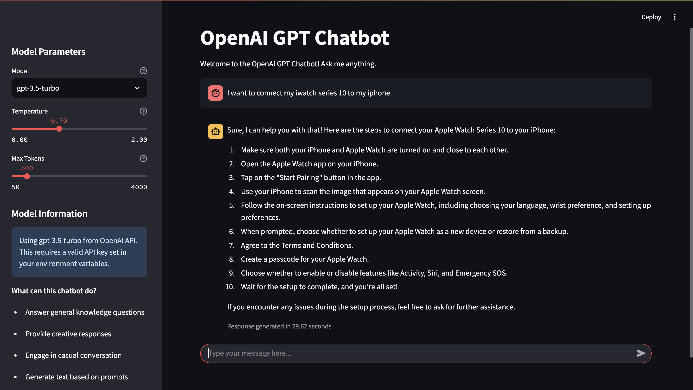

# OpenAI GPT Chatbot

An interactive conversational AI built with Streamlit and OpenAI's GPT models. This project implements a responsive chat interface with customizable parameters for controlling response generation.

## Features

- Intuitive chat interface with conversation history
- Support for GPT-3.5 Turbo and GPT-4 models
- Adjustable parameters (temperature, max tokens)
- Real-time response generation with performance metrics
- Easy deployment with Streamlit

## Overview

This project demonstrates modern NLP capabilities with a focus on usability and flexibility. It is ideal for:

- Educational purposes
- Prototyping conversational interfaces
- Serving as a foundation for more specialized applications